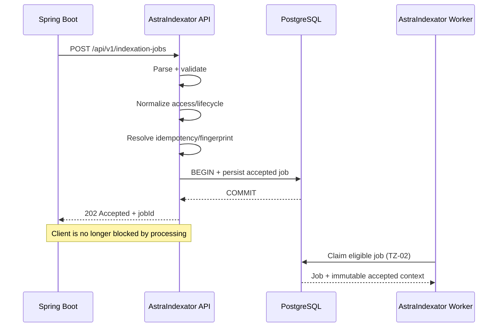
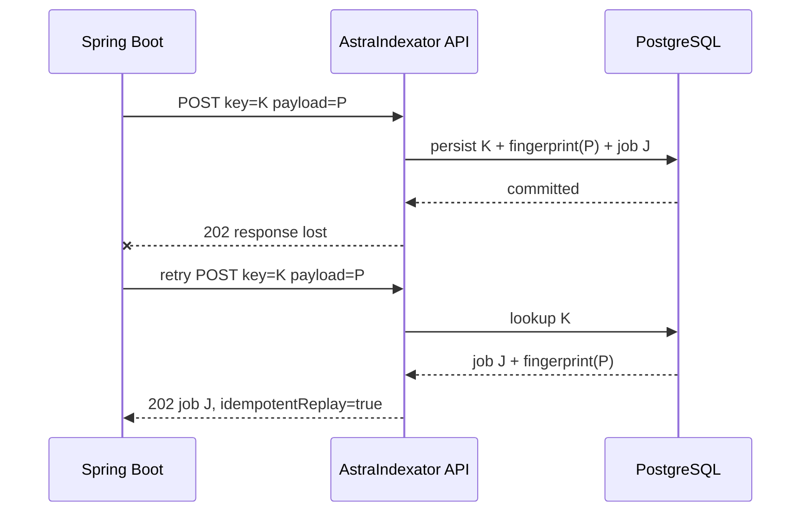

# TZ-01 — Indexation API & Job Contract

## 1. Document status

- **System:** AstraIndexator 1.0
- **Specification:** TZ-01
- **Title:** Indexation API & Job Contract
- **Status:** Design baseline
- **Parent specification:** `TZ-00-system-architecture.md`
- **Primary integration:** Spring Boot producer → AstraIndexator
- **Related specifications:** TZ-02, TZ-03, TZ-09, TZ-10, TZ-11, TZ-12, TZ-14, TZ-16, TZ-17

---

## 2. Purpose

This specification defines the external contract by which a Spring Boot application requests asynchronous document indexation in AstraIndexator.

The contract shall define:

1. the REST API boundary;
2. request and response DTOs;
3. document and job identity semantics;
4. source-object reference semantics;
5. idempotency rules;
6. access-zone input compatibility;
7. TTL and expiration input semantics;
8. validation rules;
9. durable job-acceptance semantics;
10. error contract;
11. status-query requirements;
12. correlation and observability fields;
13. compatibility/versioning requirements;
14. acceptance criteria for implementation.

This specification does **not** define worker claim/lease mechanics or the complete internal state machine. Those belong to TZ-02.

---

## 3. Business objective

A producer system must be able to request indexing of a document that already exists in the configured object storage without waiting synchronously for parsing, OCR, logical splitting or AstraVector indexing to finish.

The producer must receive a stable job identifier after AstraIndexator has durably accepted the request.

The producer must be able to safely repeat a request after client timeout, network failure or uncertain delivery without accidentally creating duplicate logical ingestion work.

---

## 4. Scope

### 4.1 In scope

TZ-01 covers:

- creation of an indexation job;
- external validation of the request;
- durable persistence of accepted job intent;
- idempotency at request-acceptance boundary;
- source reference to an already uploaded object;
- document/business metadata accepted from Spring Boot;
- access-zone compatibility fields;
- lifecycle/TTL fields;
- retrieval of job status by job ID;
- API-level correlation identifiers;
- standardized API errors.

### 4.2 Out of scope

TZ-01 does not define:

- binary/multipart document upload;
- SeaweedFS object layout implementation details;
- PostgreSQL claim/lease SQL;
- parser behavior;
- OCR behavior;
- logical splitting;
- `DocumentBlock` internal structure;
- AstraVector ingestion payload details;
- deletion/reindex replacement implementation;
- embedding/tokenization/vector search.

These are defined in child specifications.

---

## 5. Architectural decision: asynchronous REST job API

The canonical external pattern for AstraIndexator 1.0 shall be:

```text
Spring Boot
    |
    | POST /api/v1/indexation-jobs
    v
AstraIndexator API
    |
    | validate + normalize + persist atomically
    v
PostgreSQL
    |
    `-- durable job identity
            |
            v
      HTTP 202 Accepted
```

`202 Accepted` means:

> AstraIndexator has accepted and durably persisted the request for asynchronous processing.

It does **not** mean:

- source file has already been downloaded;
- source object exists and has been fully processed;
- OCR succeeded;
- AstraVector accepted the document;
- indexation is complete.

Final completion is represented by the asynchronous job state.

---

## 6. API versioning

Initial external contract prefix:

```text
/api/v1
```

Canonical endpoints for AstraIndexator 1.0:

```text
POST /api/v1/indexation-jobs
GET  /api/v1/indexation-jobs/{jobId}
```

Future incompatible API changes require a new API major version or an explicitly documented compatibility strategy.

The transport version and internal document-contract/schema version are separate concerns.

---

## 7. Create indexation job endpoint

### 7.1 Request

```http
POST /api/v1/indexation-jobs
Content-Type: application/json
Accept: application/json
```

Recommended correlation headers:

```http
X-Correlation-Id: <string>
Idempotency-Key: <string>
```

`Idempotency-Key` is RECOMMENDED for producer-generated request identity and may become mandatory for selected integrations.

`X-Correlation-Id` is optional from the client. If absent, AstraIndexator MUST generate one.

### 7.2 Successful response

```http
HTTP/1.1 202 Accepted
Content-Type: application/json
Location: /api/v1/indexation-jobs/{jobId}
```

Example:

```json
{
  "apiVersion": "v1",
  "jobId": "01K2N4Y7T0V4E8J6TQ77Q4J1RA",
  "documentId": "contract-2026-000123",
  "status": "PENDING",
  "acceptedAt": "2026-08-22T07:45:12.421Z",
  "correlationId": "0bd57051-d196-45d5-8d46-d08e942da969",
  "idempotentReplay": false
}
```

The response MUST contain a stable `jobId` that can be used to query status.

---

## 8. Canonical request DTO

Conceptual JSON contract:

```json
{
  "apiVersion": "v1",
  "document": {
    "documentId": "contract-2026-000123",
    "documentVersion": "1",
    "fileName": "contract.pdf",
    "contentType": "application/pdf",
    "source": {
      "storage": "SEAWEEDFS",
      "bucket": "documents",
      "objectKey": "original/contract-2026-000123/contract.pdf",
      "versionId": null,
      "etag": null
    }
  },
  "indexing": {
    "profile": "default",
    "forceReindex": false
  },
  "access": {
    "accessZoneId": null,
    "accessZoneIds": ["6c84a7a8-1460-4fa7-a544-57c472667f51"],
    "accessZoneCode": null,
    "accessZoneCodes": ["INTERNAL"]
  },
  "lifecycle": {
    "ttlSeconds": 86400,
    "expiresAt": null
  },
  "metadata": {
    "title": "Договор поставки",
    "sourceSystem": "document-service",
    "businessEntityType": "CONTRACT",
    "businessEntityId": "C-123"
  },
  "requestedBy": {
    "system": "document-service",
    "subject": "service-account"
  }
}
```

This representation is the design baseline. Exact field types are defined below.

---

## 9. Top-level request fields

| Field | Type | Required | Semantics |
|---|---|---:|---|
| `apiVersion` | string | yes | Contract major version, initially `v1` |
| `document` | object | yes | Stable document identity and source reference |
| `indexing` | object | no | Indexing-policy request options |
| `access` | object | conditional | Access-zone information propagated through indexing |
| `lifecycle` | object | no | TTL/expiration request |
| `metadata` | object | no | Business metadata not used as orchestration identity |
| `requestedBy` | object | no | Calling-system/audit context |

Unknown fields SHOULD be rejected in strict contract mode unless explicit forward-compatible extension rules are introduced later.

---

## 10. Document identity contract

### 10.1 `documentId`

`document.documentId` is the stable logical identifier of the document in the producer/business domain.

Requirements:

- MUST be non-empty;
- MUST remain stable across processing retries;
- SHOULD remain stable across document version changes when the business object is the same logical document;
- MUST NOT be generated from a transient AstraIndexator processing attempt;
- is distinct from `jobId`.

Example:

```text
contract-2026-000123
```

### 10.2 `documentVersion`

`document.documentVersion` identifies a producer-visible version/revision of the logical document.

The value MAY be numeric, UUID-like, hash-like or domain-specific, but its comparison semantics must not be inferred unless explicitly configured.

AstraIndexator MUST treat it as an opaque string.

Examples:

```text
1
2
2026-08-22T10:00:00Z
rev-17
```

The exact create/update/replacement semantics are defined in TZ-12.

### 10.3 `jobId`

`jobId` is generated by AstraIndexator and identifies one durable accepted job record.

Recommended format:

- UUID v7; or
- ULID.

The implementation MUST choose one canonical sortable identifier format and use it consistently.

`jobId` MUST NOT be reused for a different accepted logical request.

### 10.4 Processing attempt identity

A processing attempt is not part of the external create request.

One durable job may have multiple internal processing attempts due to retries/recovery.

```text
documentId != jobId != processingAttemptId
```

---

## 11. Source object contract

### 11.1 Principle

AstraIndexator 1.0 does not accept the binary file in the create-job request.

The source object MUST already be available in configured object storage, initially SeaweedFS.

### 11.2 `source` DTO

| Field | Type | Required | Description |
|---|---|---:|---|
| `storage` | enum/string | yes | Initially `SEAWEEDFS` |
| `bucket` | string | conditional | Logical bucket/collection if deployment uses it |
| `objectKey` | string | yes | Canonical storage object key/path |
| `versionId` | string | no | Object-store version if supported/configured |
| `etag` | string | no | Producer-known object version/integrity hint |

### 11.3 Security rule

The request SHOULD carry a logical storage reference, not an arbitrary external HTTP URL.

AstraIndexator MUST NOT implement unrestricted server-side fetching of arbitrary producer-supplied URLs because that would create an SSRF/security boundary.

Canonical design:

```text
storage + bucket + objectKey
```

rather than:

```text
https://arbitrary-host.example/file.pdf
```

If URL-based sources are introduced later, allowed protocols, hosts and trust rules require a separate explicit security decision.

### 11.4 Source existence validation

Job acceptance SHOULD validate the source reference syntactically but MUST NOT require expensive full source download before returning `202`.

Whether AstraIndexator performs a lightweight object-existence/metadata check synchronously is configurable and must not compromise durable asynchronous acceptance.

Definitive acquisition/content validation belongs to TZ-04.

---

## 12. File metadata hints

### 12.1 `fileName`

Optional producer-provided file name used for:

- diagnostics;
- parser hints;
- provenance;
- audit/display metadata.

It MUST NOT be trusted as the only file-type validation mechanism.

### 12.2 `contentType`

Optional producer-provided MIME hint such as:

```text
application/pdf
image/png
image/jpeg
```

AstraIndexator MUST verify content independently during acquisition according to TZ-04.

Client-provided `contentType` is not authoritative.

---

## 13. Indexing options

Conceptual DTO:

```json
{
  "profile": "default",
  "forceReindex": false
}
```

### 13.1 `profile`

Identifies a server-known indexing profile.

The client MAY request a profile by stable name, but MUST NOT submit arbitrary parser/OCR implementation configuration in the public request contract.

Examples:

```text
default
ocr-heavy
legal-documents
```

Unknown profiles MUST fail validation.

The profile is resolved by AstraIndexator to server-controlled versioned processing configuration.

### 13.2 `forceReindex`

`forceReindex` is reserved for explicit reprocessing semantics.

Default:

```json
false
```

It MUST NOT disable request idempotency.

Its exact interaction with document versions and replacement is defined in TZ-12.

---

## 14. Access-zone compatibility contract

The external request may receive compatibility fields:

```text
accessZoneId
accessZoneIds[]
accessZoneCode
accessZoneCodes[]
```

Canonical request location:

```json
{
  "access": {
    "accessZoneId": "...",
    "accessZoneIds": ["..."],
    "accessZoneCode": "...",
    "accessZoneCodes": ["..."]
  }
}
```

AstraIndexator MUST normalize singular and plural forms at acceptance time while preserving semantics.

Conceptually:

```text
accessZoneId + accessZoneIds[]
             |
             v
normalizedAccessZoneIds[]
```

and:

```text
accessZoneCode + accessZoneCodes[]
               |
               v
normalizedAccessZoneCodes[]
```

Normalization MUST:

1. ignore absent values;
2. reject syntactically invalid values;
3. preserve all supplied distinct values;
4. remove exact duplicates;
5. use deterministic ordering for canonical persistence/hashing where required;
6. never silently discard a singular value because plural fields are also supplied.

Whether an ID and code must resolve to the same zone is a business/integration rule defined in TZ-10, not inferred by TZ-01.

The normalized access context MUST be durably persisted with the job so retries cannot lose access metadata.

---

## 15. TTL and expiration contract

The request may supply:

```json
{
  "lifecycle": {
    "ttlSeconds": 86400,
    "expiresAt": null
  }
}
```

### 15.1 `ttlSeconds`

Relative lifetime in seconds measured from successful request acceptance time.

If accepted at:

```text
2026-08-22T07:45:12Z
```

and:

```text
ttlSeconds = 86400
```

then canonical persisted value becomes:

```text
expiresAt = 2026-08-23T07:45:12Z
```

### 15.2 `expiresAt`

Absolute expiration timestamp in UTC/RFC 3339-compatible representation.

### 15.3 Mutual-input rule

Recommended AstraIndexator 1.0 rule:

- client MAY provide `ttlSeconds`;
- client MAY provide `expiresAt`;
- client MUST NOT provide both simultaneously.

If both are supplied, return validation error.

This removes ambiguity and avoids conflicting lifecycle intent.

### 15.4 Canonicalization

AstraIndexator MUST persist a canonical absolute `expiresAt` for any expiring job/document.

Retries MUST reuse the original accepted `expiresAt` and MUST NOT restart the TTL clock.

Detailed lifecycle semantics are defined in TZ-10/TZ-12.

---

## 16. Business metadata

`metadata` contains producer/domain data to be propagated where permitted by later canonical contracts.

Example:

```json
{
  "title": "Договор поставки",
  "sourceSystem": "document-service",
  "businessEntityType": "CONTRACT",
  "businessEntityId": "C-123"
}
```

### 16.1 Rules

- metadata MUST NOT determine AstraIndexator job identity;
- metadata keys/values MUST be bounded by size limits;
- secrets/passwords/tokens MUST NOT be placed in metadata;
- implementation must define whether arbitrary extension keys are allowed or whether a schema registry/allow-list is used;
- metadata intended for AstraVector must be represented safely in TZ-09/TZ-11.

Recommended 1.0 direction: allow a bounded JSON object with scalar/string-array values only, rejecting deeply nested arbitrary structures.

---

## 17. Requested-by/audit context

Conceptual structure:

```json
{
  "system": "document-service",
  "subject": "service-account"
}
```

`requestedBy.system` identifies the calling business/service system.

`requestedBy.subject` is optional audit context and MUST NOT be trusted as authentication identity unless populated from a trusted gateway/security layer.

Authentication and authorization are defined in TZ-16.

---

## 18. Idempotency contract

### 18.1 Objective

A client must be able to retry a create request after an uncertain response without creating unintended duplicate work.

Typical failure:

```text
Spring Boot -> POST
AstraIndexator -> persist job
AstraIndexator -> 202 response
network breaks
Spring Boot never receives response
Spring Boot retries POST
```

The second request must be recognized as a replay when the same idempotency identity and same payload are used.

### 18.2 `Idempotency-Key`

Recommended request header:

```http
Idempotency-Key: 1b59c89c-8cf1-4a17-a843-8bad76755f16
```

Requirements:

- key is scoped to a defined producer identity;
- same key + semantically same canonical request → return original `jobId`;
- same key + different canonical request → return `409 Conflict`;
- key comparison MUST be based on a canonical request fingerprint, not raw JSON byte order;
- replay MUST NOT create another job row.

### 18.3 Response on replay

Example:

```json
{
  "apiVersion": "v1",
  "jobId": "01K2N4Y7T0V4E8J6TQ77Q4J1RA",
  "documentId": "contract-2026-000123",
  "status": "PENDING",
  "acceptedAt": "2026-08-22T07:45:12.421Z",
  "correlationId": "0bd57051-d196-45d5-8d46-d08e942da969",
  "idempotentReplay": true
}
```

The original job identity MUST be returned.

### 18.4 Canonical request fingerprint

At acceptance, AstraIndexator SHOULD compute a request fingerprint from normalized material fields.

Conceptual input:

```text
apiVersion
+ producer identity
+ documentId
+ documentVersion
+ source canonical reference
+ indexing profile
+ normalized access-zone values
+ canonical expiresAt/lifecycle intent
+ relevant metadata
```

The exact cryptographic representation and persistence belong to TZ-02/TZ-09, but SHA-256 over canonical JSON is a recommended baseline.

### 18.5 Separation from AstraVector ingestion idempotency

API request idempotency and AstraVector delivery idempotency are separate layers:

```text
Spring Boot request idempotency
            !=
AstraVector ingestion idempotency
```

Both are required.

The latter is defined in TZ-11.

---

## 19. Durable acceptance transaction

AstraIndexator MUST NOT return `202 Accepted` until the accepted job intent has been durably committed.

Conceptual transaction:

```text
BEGIN
  validate request
  normalize request
  resolve idempotency identity
  derive acceptedAt
  derive expiresAt when ttlSeconds supplied
  persist job
  persist normalized request/access/lifecycle context
  persist idempotency record/fingerprint
COMMIT
return 202
```

If the transaction fails, AstraIndexator MUST NOT return `202`.

Queueing/job persistence must therefore be part of the durability boundary.

---

## 20. Validation rules

Validation is divided into three categories.

### 20.1 Syntactic validation

Performed before acceptance:

- valid JSON;
- supported `apiVersion`;
- required fields present;
- field lengths within bounds;
- enum values known;
- identifiers syntactically valid;
- source key format valid;
- TTL within configured limits;
- timestamp parseable;
- no `ttlSeconds` + `expiresAt` conflict;
- indexing profile exists;
- metadata size within configured limit.

### 20.2 Contract-semantic validation

Performed before acceptance where locally decidable:

- singular/plural access-zone normalization is valid;
- duplicate values are normalized;
- requested expiration is not already expired unless explicitly allowed;
- `forceReindex` combination is permitted by API version/policy;
- idempotency key does not conflict with another payload.

### 20.3 Processing validation

Deferred to asynchronous processing:

- actual source object can be acquired;
- source bytes match supported format;
- claimed MIME type matches actual content;
- PDF is parseable;
- OCR can execute;
- document can be delivered to AstraVector.

These failures update job state and are not represented as synchronous HTTP validation failures after `202`.

---

## 21. Recommended field constraints

Exact limits must be configurable and verified by tests. Initial design bounds:

| Field | Proposed limit |
|---|---:|
| `documentId` | 1..256 characters |
| `documentVersion` | 1..128 characters |
| `fileName` | <= 512 characters |
| `source.bucket` | <= 128 characters |
| `source.objectKey` | <= 2048 characters |
| `Idempotency-Key` | 1..256 characters |
| `X-Correlation-Id` | <= 256 characters |
| access zone IDs count | configurable, initial max 100 |
| access zone codes count | configurable, initial max 100 |
| single access zone code | <= 128 characters |
| total metadata JSON | configurable, initial max 64 KiB |
| request JSON body | configurable, initial max 256 KiB |

Limits must prevent unbounded persistence/logging and abuse.

---

## 22. Job status endpoint

### 22.1 Request

```http
GET /api/v1/indexation-jobs/{jobId}
```

### 22.2 Response example

```json
{
  "apiVersion": "v1",
  "jobId": "01K2N4Y7T0V4E8J6TQ77Q4J1RA",
  "documentId": "contract-2026-000123",
  "documentVersion": "1",
  "status": "PARSING",
  "acceptedAt": "2026-08-22T07:45:12.421Z",
  "startedAt": "2026-08-22T07:45:13.010Z",
  "completedAt": null,
  "expiresAt": "2026-08-23T07:45:12.421Z",
  "attempt": 1,
  "correlationId": "0bd57051-d196-45d5-8d46-d08e942da969",
  "error": null
}
```

### 22.3 Status representation

External API MAY expose the canonical states defined by TZ-02 or a stable mapped subset.

If internal state granularity changes, external compatibility must not be broken accidentally.

Recommended 1.0 external states:

```text
PENDING
PROCESSING
RETRY_WAIT
COMPLETED
FAILED
DEAD_LETTER
CANCELLED
```

Detailed internal states such as `PARSING`, `OCR_PROCESSING` and `DELIVERING` MAY additionally be exposed as `stage` rather than making all internal states part of the stable public API.

Recommended model:

```json
{
  "status": "PROCESSING",
  "stage": "PARSING"
}
```

This decouples external lifecycle from internal pipeline evolution.

---

## 23. Error DTO

All API-level failures SHOULD use one canonical structure.

Example:

```json
{
  "apiVersion": "v1",
  "timestamp": "2026-08-22T07:45:12.421Z",
  "status": 400,
  "code": "VALIDATION_ERROR",
  "message": "Request validation failed",
  "correlationId": "0bd57051-d196-45d5-8d46-d08e942da969",
  "violations": [
    {
      "field": "lifecycle.ttlSeconds",
      "code": "MUTUALLY_EXCLUSIVE",
      "message": "ttlSeconds and expiresAt cannot be supplied together"
    }
  ]
}
```

The API MUST NOT return internal stack traces, SQL errors, credentials or storage secrets.

---

## 24. HTTP status contract

| HTTP | Meaning |
|---:|---|
| `202 Accepted` | New job durably accepted or valid idempotent replay |
| `400 Bad Request` | Malformed request or validation failure |
| `401 Unauthorized` | Authentication required/failed if enabled by TZ-16 |
| `403 Forbidden` | Caller authenticated but not authorized |
| `404 Not Found` | Requested `jobId` does not exist or is not visible to caller |
| `409 Conflict` | Idempotency-key payload conflict or incompatible lifecycle/version conflict |
| `413 Payload Too Large` | Request metadata/body exceeds configured bound |
| `415 Unsupported Media Type` | API request content type unsupported |
| `422 Unprocessable Entity` | Optional use for semantically invalid but syntactically valid requests; choose consistently |
| `429 Too Many Requests` | Admission/backpressure/rate limit applied |
| `500 Internal Server Error` | Unexpected internal API failure |
| `503 Service Unavailable` | Service cannot safely accept durable work, e.g. PostgreSQL unavailable |

AstraIndexator SHOULD prefer `503` rather than accepting a request when the durable job store is unavailable.

---

## 25. Correlation and tracing

### 25.1 Correlation ID

For every accepted or rejected request, AstraIndexator MUST have a correlation identifier.

Resolution:

```text
client X-Correlation-Id present and valid
        -> preserve
otherwise
        -> generate server correlationId
```

The value must be propagated to:

- API response;
- structured logs;
- job persistence;
- processing attempt context;
- downstream AstraVector call where supported.

### 25.2 Trace context

If OpenTelemetry/W3C Trace Context is enabled, standard `traceparent`/`tracestate` handling SHOULD be used independently from business `correlationId`.

Do not overload one identifier to serve all purposes.

---

## 26. Logging requirements

The create endpoint MUST log structured events without logging document contents or sensitive tokens.

Minimum acceptance event fields:

```text
event=indexation_job_accepted
jobId
documentId
documentVersion
sourceSystem
indexingProfile
acceptedAt
expiresAt
correlationId
idempotentReplay
```

Access-zone values may be security-sensitive in some deployments; logging policy must be defined in TZ-14/TZ-16.

Raw request bodies SHOULD NOT be logged in production.

---

## 27. Admission control and backpressure

Because the API accepts asynchronous work, unbounded job creation can overload storage and processing capacity.

The API design MUST support admission control based on configurable conditions, for example:

- maximum pending-job count;
- per-producer rate limit;
- producer quotas;
- PostgreSQL health;
- local system pressure;
- planned maintenance/drain mode.

When AstraIndexator cannot safely accept more durable work, it SHOULD return:

```text
429 Too Many Requests
```

or:

```text
503 Service Unavailable
```

according to whether the condition is caller/quota-related or service-wide.

The API MUST NOT accept work and then silently discard it.

---

## 28. Security requirements at API boundary

Detailed controls belong to TZ-16, but TZ-01 establishes these invariants:

1. arbitrary source URLs are not accepted by default;
2. all textual fields are bounded;
3. identifiers/paths are validated before persistence/use;
4. client metadata is untrusted input;
5. producer identity used for idempotency scoping must originate from trusted authentication/gateway context where security is enabled;
6. secrets/tokens must not be persisted as arbitrary metadata;
7. error responses must not leak infrastructure internals;
8. API body size must be bounded;
9. object storage credentials are never supplied in the request DTO.

---

## 29. Database persistence requirements produced by TZ-01

TZ-01 does not prescribe table DDL, but an accepted job must persist enough immutable/canonical context for deterministic retries.

At minimum the persistence model must retain:

- `jobId`;
- producer identity/scope;
- idempotency key and canonical fingerprint where supplied;
- `documentId`;
- `documentVersion`;
- canonical source reference;
- producer file metadata hints;
- indexing profile identity;
- normalized access-zone IDs/codes;
- canonical `expiresAt`;
- accepted business metadata;
- accepted/requested-by audit context;
- `acceptedAt`;
- `correlationId`;
- initial external/internal status;
- contract/API version.

TZ-02 defines relational schema and transaction/concurrency mechanics.

---

## 30. Mutability rule after acceptance

The original accepted request intent MUST be treated as immutable audit/processing input.

Worker processing MUST NOT rewrite the original producer intent.

Derived values are stored separately, for example:

```text
accepted source metadata
vs
observed source metadata/contentHash
```

```text
requested lifecycle
vs
canonical expiresAt
```

```text
requested indexing profile name
vs
resolved parser/OCR/splitter version set
```

This separation is required for reproducibility and troubleshooting.

---

## 31. Create-job sequence



---

## 32. Idempotent-retry sequence



Conflict case:

```text
same Idempotency-Key
+ different canonical payload
= 409 Conflict
```

---

## 33. Processing-failure boundary

Example:

1. client submits valid source reference;
2. API durably accepts job and returns `202`;
3. later acquisition discovers object does not exist;
4. job enters retryable or terminal failure according to TZ-04/TZ-13;
5. `GET /indexation-jobs/{jobId}` exposes failure outcome.

The original `202` remains correct because acceptance and processing completion are intentionally separate.

---

## 34. Compatibility principles for Spring Boot DTO implementation

A Spring Boot client library/DTO SHOULD model the contract with explicit nested DTOs rather than a flat unstructured map.

Conceptual Java structure:

```text
CreateIndexationJobRequest
  |- apiVersion
  |- DocumentRequest
  |    |- documentId
  |    |- documentVersion
  |    |- fileName
  |    |- contentType
  |    `- SourceObjectRef
  |- IndexingOptions
  |- AccessContext
  |- LifecycleRequest
  |- metadata
  `- RequestedBy
```

The producer should not need knowledge of:

- PostgreSQL job rows;
- worker IDs;
- lease timestamps;
- parser class names;
- OCR model filesystem paths;
- AstraVector/Qdrant internals.

Those are server implementation details.

---

## 35. OpenAPI requirement

The implementation MUST publish or generate an OpenAPI 3.x contract for the public API.

OpenAPI must include:

- all request/response schemas;
- required/optional fields;
- enum values;
- maximum lengths/counts;
- HTTP responses;
- error DTO;
- examples;
- endpoint descriptions;
- API version.

The committed OpenAPI document and implementation must be contract-tested to prevent drift.

Recommended repository artifact:

```text
docs/contracts/astra-indexator-api-v1.yaml
```

Creation of the machine-readable OpenAPI file can follow once TZ-01 is approved.

---

## 36. Non-functional requirements

### 36.1 Availability

The API must reject rather than falsely acknowledge requests when durable storage is unavailable.

### 36.2 Latency

Create-job API latency must not depend on parser/OCR/indexing duration.

The synchronous path should include only bounded validation, normalization, optional lightweight storage metadata checks and durable persistence.

### 36.3 Scalability

Multiple API replicas must be able to accept requests concurrently while preserving idempotency guarantees through shared durable coordination.

### 36.4 Consistency

A successful `202` response implies the job can subsequently be read from the authoritative job store even if the API instance crashes immediately after response.

### 36.5 Payload bounds

API request size and variable-size collections must have explicit configured limits.

### 36.6 Time handling

All persisted and API timestamps MUST use UTC instants.

External representation SHOULD use RFC 3339/ISO-8601 UTC form, for example:

```text
2026-08-22T07:45:12.421Z
```

---

## 37. Required metrics

At minimum:

```text
astra_indexator_api_requests_total{endpoint,status}
astra_indexator_jobs_accepted_total{producer,profile}
astra_indexator_idempotent_replays_total{producer}
astra_indexator_idempotency_conflicts_total{producer}
astra_indexator_api_validation_failures_total{code}
astra_indexator_api_request_duration_seconds{endpoint}
astra_indexator_api_admission_rejections_total{reason}
```

Metric labels MUST avoid unbounded high-cardinality identifiers such as `jobId` or `documentId`.

---

## 38. Error-code baseline

Recommended stable machine-readable codes:

```text
INVALID_JSON
UNSUPPORTED_API_VERSION
VALIDATION_ERROR
INVALID_DOCUMENT_ID
INVALID_SOURCE_REFERENCE
UNSUPPORTED_STORAGE
UNKNOWN_INDEXING_PROFILE
INVALID_ACCESS_ZONE_ID
INVALID_ACCESS_ZONE_CODE
INVALID_TTL
EXPIRED_AT_ACCEPTANCE
IDEMPOTENCY_CONFLICT
PAYLOAD_TOO_LARGE
RATE_LIMITED
SERVICE_UNAVAILABLE
INTERNAL_ERROR
JOB_NOT_FOUND
```

Later specifications may add domain-specific codes without changing the basic error envelope.

---

## 39. Acceptance criteria

TZ-01 implementation is accepted only when all criteria below are demonstrably satisfied.

### AC-01 Durable acceptance

Given a valid request, when `POST /api/v1/indexation-jobs` returns `202`, a durable job with the returned `jobId` exists in PostgreSQL.

### AC-02 No premature completion semantics

`202` does not require or imply successful source acquisition, parsing, OCR, splitting or AstraVector delivery.

### AC-03 Idempotent retry

Same producer scope + same `Idempotency-Key` + same canonical request returns the original `jobId` and creates no second job.

### AC-04 Idempotency conflict

Same producer scope + same `Idempotency-Key` + different canonical request returns `409` and creates no second job.

### AC-05 Access-zone losslessness

If singular and plural access-zone values are supplied, the persisted normalized job context contains every distinct valid supplied value.

### AC-06 TTL canonicalization

If `ttlSeconds` is supplied, `expiresAt` is derived from the original acceptance time and persists unchanged across retries.

### AC-07 TTL ambiguity rejection

Supplying both `ttlSeconds` and `expiresAt` returns a validation error.

### AC-08 Source-reference security

The default API does not permit unrestricted arbitrary HTTP/HTTPS source URLs.

### AC-09 Status query

Every successfully accepted `jobId` can be queried through `GET /api/v1/indexation-jobs/{jobId}` subject to authorization rules.

### AC-10 PostgreSQL failure

If AstraIndexator cannot durably persist the job, the create endpoint does not return `202`.

### AC-11 Correlation

Every API request has a correlation identifier available in response/error, persistence and structured logs.

### AC-12 Contract validation

Automated tests verify request validation, response schemas and HTTP error mappings against the committed OpenAPI contract.

### AC-13 Payload bounds

Oversized body, metadata and configured collections are rejected predictably and cannot consume unbounded memory/storage.

### AC-14 No implementation leakage

The external producer contract contains no worker lease, parser class, OCR filesystem/model path, PostgreSQL table or Qdrant-specific fields.

---

## 40. Required verification evidence

Implementation PR for TZ-01 must include:

1. OpenAPI 3.x contract;
2. DTO validation tests;
3. idempotency integration tests with real PostgreSQL/Testcontainers;
4. transaction rollback test proving no `202` on persistence failure;
5. access-zone normalization tests;
6. TTL/expiresAt canonicalization tests;
7. status endpoint tests;
8. malformed/oversized request tests;
9. security test proving arbitrary source URL is not accepted by default;
10. observability verification for correlation IDs and bounded metrics labels.

---

## 41. Decisions intentionally deferred to child specifications

The following questions are deliberately deferred and MUST NOT be guessed during implementation of TZ-01:

- exact PostgreSQL table names/DDL/indexes → TZ-02;
- exact SeaweedFS namespace/layout → TZ-03;
- source-content hash computation → TZ-04/TZ-09;
- canonical `DocumentContext` and `DocumentBlock` → TZ-09;
- ID/code cross-validation and access-policy semantics → TZ-10;
- AstraVector ingestion key and payload → TZ-11;
- create/update/reindex/delete behavior → TZ-12;
- retry/backoff/dead-letter mechanics → TZ-13;
- authentication/mTLS/JWT/network trust model → TZ-16.

---

## 42. Recommended next design step

After approval of TZ-01, TZ-02 must derive the PostgreSQL data model and atomic job-creation/claim semantics directly from this contract.

The primary traceability chain is:

```text
TZ-01 CreateIndexationJobRequest
        |
        v
TZ-02 durable job schema/state coordination
        |
        v
TZ-09 canonical DocumentContext/DocumentBlock
        |
        v
TZ-11 AstraVector ingestion contract
```

No child specification may redefine the meaning of `documentId`, `jobId`, request idempotency, normalized access context or canonical `expiresAt` without an explicit architecture decision and corresponding update to this specification.
