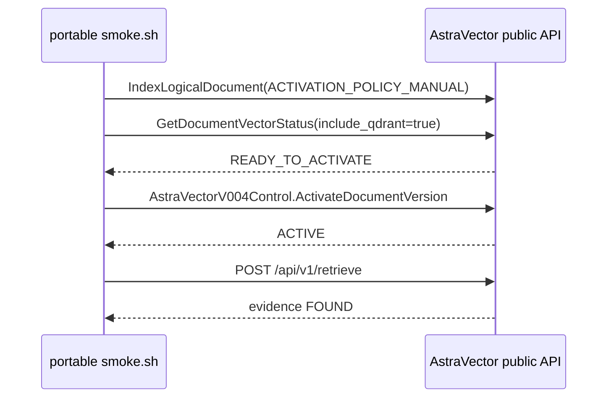

# CODEX-08 AstraVector Runtime Research

Date: 2026-08-29

Final research verdict: **PASS**

Research completeness is PASS because the validated runtime behavior was reproduced, the working
single-call lifecycle was mapped, the failing session-ingestion lifecycle was isolated without
AstraIndexator, and the remediation boundary is clear.

## 1. Executive Conclusion

The validated AstraVector image supports the single-call `IndexLogicalDocument` ingestion lifecycle
with manual activation and HTTP retrieval. It also supports session `StartLogicalDocumentIngestion`,
`AppendLogicalDocumentBlocks`, append replay, append conflict rejection, status persistence, and
restart persistence.

The session `FinalizeLogicalDocumentIngestion` path is not currently satisfiable through public APIs.
Direct session Finalize fails without AstraIndexator involved:

```text
INVALID_ARGUMENT:
UNSUPPORTED_ACTIVATION_POLICY_AUTO_WHEN_READY:
AUTO_WHEN_READY requires lifecycle auto-activation worker and is disabled in v007 fix1
```

Primary root cause: **C. AstraVector implementation defect**. The session Finalize implementation
hardcodes `ActivationPolicy::AutoWhenReady` internally, while the same runtime unconditionally
rejects `AUTO_WHEN_READY`.

## 2. Exact Baselines

| Item | Value |
| --- | --- |
| ASTRAINDEXATOR_BRANCH | `codex/real-pdf-smoke` |
| ASTRAINDEXATOR_REFERENCE_SHA | `65347794012e381ae0ff485ea3ad6ccc83375090` |
| ASTRADEPLOYMENT_SHA | `cc7dd29256065be1734223fc112813e445109bd0` |
| LLM2_SHA | `2142e2bd328c8964dbb3c2eff52caf8a350c5ddf` |
| AstraVector image | `registry.astrabase.asia/astravector:sha-1cb6065` |
| AstraVector digest | `sha256:b0567810b5ea3df752ff8ba559fcf16bc46b245878e798b8888dcf93426ee6ad` |
| Image ID | `sha256:b0567810b5ea3df752ff8ba559fcf16bc46b245878e798b8888dcf93426ee6ad` |
| Image architecture | `linux/arm64` |

## 3. Host And Runtime Inventory

| Item | Value |
| --- | --- |
| macOS | `15.6` build `24G84` |
| Host CPU architecture | `arm64` |
| Docker Desktop | `4.43.2 (199162)` |
| Docker Engine server | `28.3.2`, `linux/arm64` |
| Docker client | `28.3.3`, `darwin/arm64` |
| Free disk at baseline | about `8.6 GiB` |
| Portable containers | `astradeployment-astravector-1`, `astradeployment-postgres-1`, `astradeployment-qdrant-1` |
| Public gRPC | `127.0.0.1:50051` |
| Public HTTP | `127.0.0.1:8080` |
| Metrics | `127.0.0.1:9090` |
| Qdrant | `127.0.0.1:6333` |

Relevant preserved resources included `astradeployment-postgres-data`,
`astradeployment-qdrant-data`, `astradeployment-model-cache`, and
`astradeployment-network`. No volumes were deleted during this research.

## 4. Native Portable Smoke

| Gate | Result |
| --- | --- |
| `make preflight` | PASS; Docker ready, architecture `arm64`, model cache existing |
| `make start` | PASS after supported restart; image digest unchanged |
| `make health` | PASS; PostgreSQL, Qdrant, HTTP `/ready`, and gRPC health were healthy |
| `make smoke` | PASS |

Native smoke sequence from `deploy/local/scripts/smoke.sh`:



This proves the single-call public lifecycle, not the session-ingestion lifecycle.

## 5. Single-Call Ingestion Lifecycle

Disposable direct public gRPC test using `access_zone_code=0000`:

| Step | Result |
| --- | --- |
| `IndexLogicalDocument` | PASS, 2 blocks accepted, 7 chunks created |
| Activation policy | `ACTIVATION_POLICY_MANUAL` |
| Status progression | `PUBLISHING` -> `READY_TO_ACTIVATE` |
| Explicit activation | PASS via `AstraVectorV004Control.ActivateDocumentVersion` |
| HTTP retrieval | PASS, same disposable document returned |
| Post-restart retrieval | PASS, same document was still retrievable |

The successful direct document resolved `access_zone_code=0000` server-side to
`34095d27-bb9c-522b-8e5e-17565961916b`.

## 6. Session-Ingestion Lifecycle

Disposable direct public gRPC test, without AstraIndexator:

| Step | Result |
| --- | --- |
| `StartLogicalDocumentIngestion` | PASS |
| Initial session status | `ACTIVE` |
| `AppendLogicalDocumentBlocks` | PASS, 2 blocks accepted |
| Identical append replay | PASS, idempotent acceptance |
| Conflicting append | PASS as integrity rejection: `FAILED_PRECONDITION BATCH_HASH_MISMATCH` |
| `FinalizeLogicalDocumentIngestion` | FAIL, `INVALID_ARGUMENT UNSUPPORTED_ACTIVATION_POLICY_AUTO_WHEN_READY` |
| Status after failed Finalize | `FAILED`, `error_code=INDEXING_FAILED` |
| Finalize retry | deterministic terminal failure: `FAILED_PRECONDITION INGESTION_SESSION_FAILED:INDEXING_FAILED:...` |
| Abort after failed Finalize | rejected: `FAILED_PRECONDITION INGESTION_SESSION_FAILED` |

## 7. Session Finalize Reproduction

The critical failure was reproduced with only public AstraVector gRPC and disposable text:

```text
grpc_code = INVALID_ARGUMENT
details   = UNSUPPORTED_ACTIVATION_POLICY_AUTO_WHEN_READY:
            AUTO_WHEN_READY requires lifecycle auto-activation worker and is disabled in v007 fix1
```

Therefore:

```text
ASTRAINDEXATOR_CAUSALITY = EXCLUDED
```

## 8. Restart And Persistence Behavior

Supported restart flow:

```text
make stop
make start
make health
```

Results:

| Scenario | Result |
| --- | --- |
| Single-call activated document after restart | PASS; HTTP retrieval found same document |
| Session after Start/Append before restart | PASS; session persisted as `ACTIVE`, 1 batch, 2 blocks |
| Finalize after restart | FAIL with the same `UNSUPPORTED_ACTIVATION_POLICY_AUTO_WHEN_READY` |

The Finalize blocker is deterministic and persists across runtime restart.

## 9. AccessZone Behavior

| Path | AccessZone input | Result |
| --- | --- | --- |
| Native portable smoke | `access_zone_code=0488` plus configured UUID | PASS |
| Direct single-call | `access_zone_code=0000`, no producer UUID | PASS; server resolved UUID |
| Direct session | `access_zone_code=0000`, no producer UUID | Start and Append PASS |

Access-zone code resolution is runtime-owned and works for the tested public paths.

## 10. TTL Behavior

| Path | TTL input | Result |
| --- | --- | --- |
| Direct single-call | `TTL_MODE_NONE` | PASS |
| Direct single-call | `TTL_MODE_RELATIVE`, `ttl_seconds=86400` | PASS |
| Direct session | `ttl_days=0` | Start and Append PASS; Finalize blocked before TTL completion |
| Negative TTL | Not representable in public protobuf unsigned fields | Client/serialization boundary |

`TTL_RUNTIME = PASS` for successful single-call lifecycle; session TTL completion remains blocked by
session Finalize.

## 11. Error-Contract Behavior

| Operation | gRPC code | Structured details |
| --- | --- | --- |
| Conflicting append | `FAILED_PRECONDITION` | `BATCH_HASH_MISMATCH` |
| First failed Finalize | `INVALID_ARGUMENT` | `UNSUPPORTED_ACTIVATION_POLICY_AUTO_WHEN_READY: ...` |
| Finalize retry after FAILED | `FAILED_PRECONDITION` | `INGESTION_SESSION_FAILED:INDEXING_FAILED:...` |
| Abort after FAILED | `FAILED_PRECONDITION` | `INGESTION_SESSION_FAILED` |

`ERROR_CONTRACT_SUFFICIENCY = WARN`: machine-readable reason prefixes exist, but clients still need
to parse the detail string to distinguish some failure causes.

## 12. Public Recovery Behavior

After failed Finalize, public session status exposes:

| Field | Observed |
| --- | --- |
| `ingestion_session_id` | present |
| `status` | `FAILED` |
| `received_batches` | `1` |
| `received_blocks` | `2` |
| `error_code` | `INDEXING_FAILED` |
| `error_message` | activation-policy error |

It does not expose a completed `DocumentRef`, `access_zone_id`, readiness, or searchability. Public
Finalize recovery is therefore:

```text
PUBLIC_FINALIZE_RECOVERY = BLOCKED
```

## 13. llm2 Code Trace

Key source evidence in `llm2/src/grpc/mod.rs`:

| Lines | Evidence |
| --- | --- |
| `5732-5735` | `IndexLogicalDocument` normalizes content hash, loads indexing options, and calls `reject_unsupported_activation_policy`. |
| `5762-5777` | TTL validation and effective TTL selection. |
| `5846-5851` | `MANUAL`/default single-call path returns `INDEXING`; `AUTO_WHEN_READY` would return `PUBLISHING` if accepted. |
| `6159-6247` | session Finalize acquires `ACTIVE -> FINALIZING` ownership and handles replay/failed states. |
| `6382-6408` | staged batch and final content hash validation happen before indexing. |
| `6429-6441` | session `ttl_days` maps to relative `TtlPolicy` only when positive. |
| `6465-6467` | session Finalize hardcodes `activation_policy: AutoWhenReady`. |
| `6517-6526` | indexing failure marks session `FAILED` with `INDEXING_FAILED`. |
| `8533-8537` | `reject_unsupported_activation_policy` rejects `AutoWhenReady` with `INVALID_ARGUMENT`. |

`llm2/docs/V007_FIX1_INTERFACE_CONSISTENCY.md` states that `AUTO_WHEN_READY` is explicitly rejected
until the lifecycle auto-activation worker is implemented, and lists full `AUTO_WHEN_READY` worker
as intentionally deferred.

## 14. Single-Call Vs Session Comparison

| Stage | `IndexLogicalDocument` | Session Start/Append/Finalize |
| --- | --- | --- |
| Document accepted | PASS | Start/Append PASS |
| Activation policy | Caller can select `MANUAL` | Caller cannot select; Finalize hardcodes `AUTO_WHEN_READY` |
| Vectoring | PASS | Not reached successfully |
| READY_TO_ACTIVATE | PASS | Not reached |
| Explicit activation | PASS via `ActivateDocumentVersion` | Not reachable |
| ACTIVE | PASS | Not reachable |
| Retrieval | PASS | Not reachable |

Single-call works because it can legally use `MANUAL` and explicit activation. Session ingestion
fails because its public API has no activation-policy field and its implementation chooses a policy
that the same runtime rejects.

## 15. AstraIndexator Request Comparison

Compared structurally, without sensitive payload text:

| Area | Direct session test | AstraIndexator B2 path |
| --- | --- | --- |
| Start | public Start with `access_zone_code`, doc id/version, content hash, ttl | same class of public request |
| Append | canonical batch hash and explicit default `SourceLocation` | same after CODEX-07B fix |
| Finalize | public Finalize with session id and final content hash | same public RPC shape |
| Failure | `UNSUPPORTED_ACTIVATION_POLICY_AUTO_WHEN_READY` | same error after SourceLocation fix |

The previously found AstraIndexator `SourceLocation()` interoperability issue was fixed before
CODEX-08. Direct session reproduction proves the remaining Finalize blocker is not caused by
AstraIndexator.

## 16. Root Cause

Decision tree result:

```text
C. AstraVector implementation defect
```

Evidence:

1. Direct session Finalize fails without AstraIndexator.
2. Public session request schemas do not expose `activation_policy`.
3. llm2 Finalize hardcodes `AutoWhenReady`.
4. llm2 validator rejects `AutoWhenReady`.
5. llm2 documentation says the auto-activation worker is intentionally deferred.
6. The same failure persists across restart.

There is also a related public-contract insufficiency: the session API cannot express any activation
policy, so a client cannot select a supported lifecycle.

## 17. Architecture Options

| Model | Summary | Score |
| --- | --- | --- |
| Model 1 | Start -> Append -> Finalize(MANUAL internally) -> READY_TO_ACTIVATE -> public Activate -> SEARCHABLE | Best near-term. Simple, restart-safe, backward compatible with current successful smoke path, no proto change required if Finalize always uses MANUAL. Requires AstraVector runtime change. |
| Model 2 | Start -> Append -> Finalize(AUTO_WHEN_READY) -> automatic activation worker -> SEARCHABLE | Good long-term operability, but currently unsupported. Requires runtime worker, lifecycle hardening, and a new image. |
| Model 3 | Start exposes `activation_policy`; caller chooses supported policy | Most explicit contract. Requires proto/runtime/client updates but gives best consumer control and future compatibility. |

Recommended architecture model: **Model 1 now, with Model 3 as the explicit future contract if
consumer-selectable activation is required.**

## 18. Recommended Remediation

```text
RECOMMENDED_REMEDIATION = Change llm2/AstraVector session Finalize to use a supported activation
policy, preferably MANUAL, then rely on public ActivateDocumentVersion after READY_TO_ACTIVATE.
```

| Question | Answer |
| --- | --- |
| Owner repository | `llm2` |
| Likely files/components | `src/grpc/mod.rs`, session Finalize lifecycle tests, docs/proto only if Model 3 is chosen |
| Proto change needed | NO for Model 1; YES for Model 3 |
| Runtime change needed | YES |
| AstraDeployment change needed | NO, except to point to a new validated image/tag after runtime fix |
| AstraIndexator change needed | NO for bypass; only adapt later if public contract legitimately changes |
| New OCI image required | YES |

## 19. Defects

| ID | Severity | Owner | Contract | Reproduction | Expected | Actual | Root Cause | Remediation |
| --- | --- | --- | --- | --- | --- | --- | --- | --- |
| AV-RUNTIME-01 | P0 | AstraVector / llm2 | Public session ingestion | Start -> Append -> Finalize via public gRPC | Finalize should reach an indexable lifecycle state | `INVALID_ARGUMENT UNSUPPORTED_ACTIVATION_POLICY_AUTO_WHEN_READY` | Finalize hardcodes rejected `AutoWhenReady` | Use `MANUAL` internally or implement auto-activation worker |
| AV-CONTRACT-01 | P1 | AstraVector / llm2 | Public session proto/API | Inspect Start/Finalize schemas | Session client can select or infer supported activation lifecycle | No session RPC exposes `activation_policy` | API cannot express supported lifecycle | Add field in a future contract or document fixed MANUAL behavior |
| AV-ERROR-01 | P2 | AstraVector / llm2 | Public error model | Append conflict and Finalize failures | Structured machine-readable reasons | Reason prefixes are embedded in detail strings | Error details are partially structured | Add typed error details or stable reason fields |

## 20. Final Research Verdict

```text
PASS
```

Research is complete. The environment did not block the experiments. The smallest correct
remediation is in AstraVector/llm2, not in AstraIndexator.

## Evidence Matrix

| Gate | Result |
|---|---|
| Image identity | PASS |
| Portable preflight | PASS |
| Portable start | PASS |
| Portable health | PASS |
| Native smoke | PASS |
| gRPC reflection | PASS |
| Single-call ingestion | PASS |
| Single-call status | PASS |
| Explicit activation | PASS |
| Single-call retrieval | PASS |
| Direct session Start | PASS |
| Session status after Start | PASS |
| Direct session Append | PASS |
| Append replay | PASS |
| Append conflict | PASS |
| Direct session Finalize | FAIL |
| Finalize retry behavior | PASS, deterministic terminal failure understood |
| Session restart persistence | PASS |
| AccessZone runtime | PASS |
| TTL runtime | PASS |
| Error contract | WARN |
| Public recovery | BLOCKED |
| SourceLocation interoperability | PASS |
| llm2 implementation trace | PASS |
| Root cause established | PASS |
| Remediation identified | PASS |
